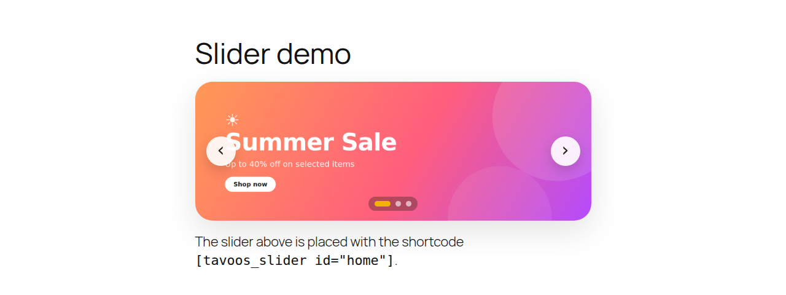
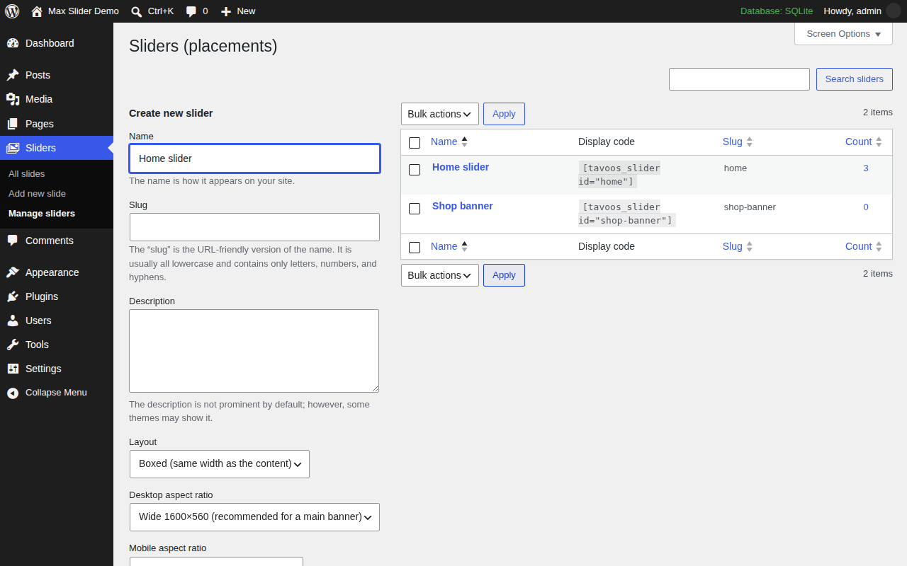
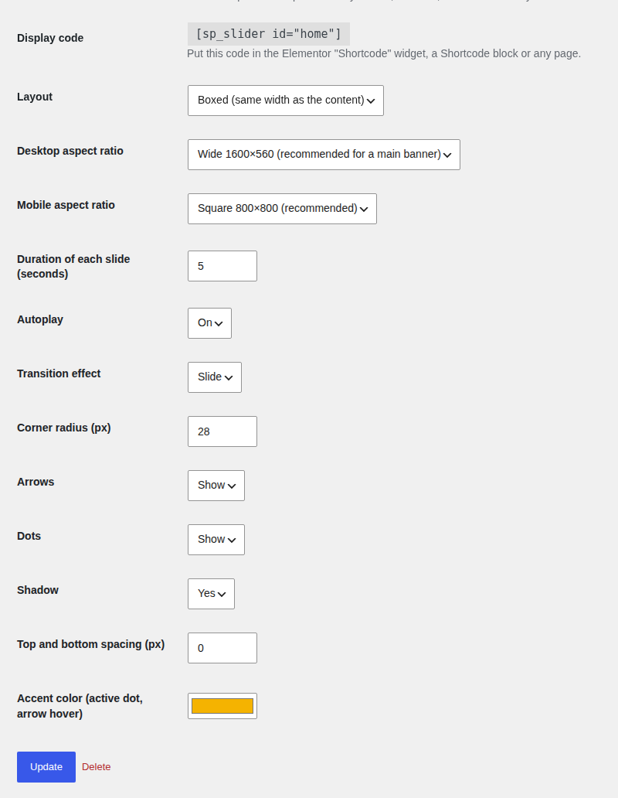
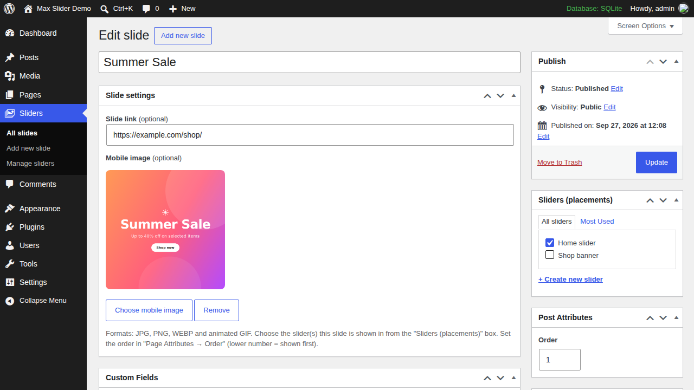
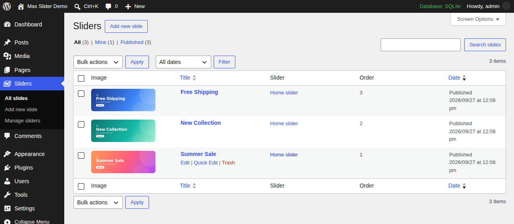

<h1 align="center">Max Slider for WordPress</h1>

<p align="center">
  <a href="https://github.com/mmhdih/Max-Slider-for-Wordpress/releases/latest"></a>
  
  
  <a href="LICENSE"></a>
</p>

<p align="center">
  <a href="https://github.com/mmhdih/Max-Slider-for-Wordpress/releases/latest/download/max-slider.zip"><b>⬇️ دانلود افزونه — Download max-slider.zip</b></a>
  <br>
  <a href="#فارسی">فارسی</a> · <a href="#english">English</a>
</p>

<p align="center">
  
</p>

---

<div dir="rtl">

## فارسی

**مکس اسلایدر** یک افزونه‌ی اسلایدر تصویر سبک و بدون وابستگی (بدون jQuery، بدون کتابخانه‌ی جانبی) برای وردپرس است. هر تعداد اسلایدر که بخواهید برای جاهای مختلف سایت می‌سازید؛ هر اسلایدر ابعاد، سرعت و ظاهر مخصوص خودش را دارد و با یک شورت‌کد در هر برگه، نوشته یا ابزارک المنتور نمایش داده می‌شود.

### ✨ ویژگی‌ها

- **چند اسلایدر مستقل** — مثلاً یک اسلایدر برای صفحه‌ی اصلی، یکی برای فروشگاه و یکی برای بنر تبلیغاتی.
- **تصویر جداگانه برای موبایل** برای هر اسلاید (اختیاری) و **لینک** برای هر اسلاید.
- **نسبت ابعاد جدا برای دسکتاپ و موبایل** (۱۶۰۰×۵۶۰، ۱۹۲۰×۶۰۰، ۱۶:۹، مربع، عمودی و …).
- **سه چیدمان:** داخل کادر، عریض (۱۴۴۰ پیکسل) و تمام عرض صفحه.
- **دو افکت:** لغزش و محو شدن.
- تنظیم **مدت نمایش، پخش خودکار، گردی گوشه‌ها، فلش‌ها، نقطه‌ها، سایه، فاصله و رنگ اصلی**.
- پشتیبانی از **JPG، PNG، WEBP و GIF متحرک**.
- **کشیدن با انگشت (Swipe)** در موبایل، کنترل با کیبورد، توقف هنگام هاور و وقتی تب مرورگر باز نیست.
- **راست‌چین و چپ‌چین** به‌صورت خودکار (جهت حرکت و فلش‌ها درست کار می‌کنند).
- **سریع و سئو-دوست:** اولین تصویر با `fetchpriority="high"` لود می‌شود، اسکریپت فقط در صفحه‌هایی که اسلایدر دارند بارگذاری می‌شود و حجم کل CSS و JS کمتر از ۸ کیلوبایت است.
- **دسترس‌پذیر:** برچسب‌های ARIA برای اسلایدر، اسلایدها، فلش‌ها و نقطه‌ها.
- **ترجمه‌ی کامل فارسی**؛ روی سایت‌های فارسی، پنل افزونه خودکار فارسی می‌شود.

### 📦 نصب

1. فایل [**max-slider.zip**](https://github.com/mmhdih/Max-Slider-for-Wordpress/releases/latest/download/max-slider.zip) را از بخش [Releases](https://github.com/mmhdih/Max-Slider-for-Wordpress/releases/latest) دانلود کنید (فایل zip را باز نکنید).
2. در پیشخوان وردپرس به **افزونه‌ها ← افزودن ← بارگذاری افزونه** بروید.
3. فایل zip را انتخاب کنید، روی **هم‌اکنون نصب کن** و بعد **فعال‌سازی** بزنید.
4. منوی جدید **اسلایدرها** در پیشخوان اضافه می‌شود.

### 🚀 نحوه‌ی استفاده

#### مرحله ۱ — ساخت اسلایدر

به **اسلایدرها ← مدیریت اسلایدرها** بروید، یک نام وارد کنید (مثلاً «اسلایدر صفحه اصلی») و تنظیمات را انتخاب کنید. **نامک** (slug) همان شناسه‌ای است که در شورت‌کد استفاده می‌شود. در ستون **کد نمایش** شورت‌کد آماده‌ی هر اسلایدر را می‌بینید.

<p align="center"></p>

#### مرحله ۲ — تنظیمات اسلایدر

روی نام اسلایدر کلیک کنید تا صفحه‌ی تنظیمات باز شود. شورت‌کد اسلایدر هم بالای همین صفحه نوشته شده است.

<p align="center"></p>

#### مرحله ۳ — افزودن اسلاید

به **اسلایدرها ← افزودن اسلاید** بروید:

- **عنوان:** فقط برای مدیریت است و به‌عنوان متن جایگزین (alt) تصویر استفاده می‌شود.
- **تصویر اسلاید (دسکتاپ):** از کادر سمت راست/چپ صفحه انتخاب کنید. **اسلاید بدون تصویر نمایش داده نمی‌شود.**
- **تصویر موبایل** (اختیاری): اگر خالی بماند، تصویر دسکتاپ در موبایل هم نمایش داده می‌شود.
- **لینک اسلاید** (اختیاری): با کلیک روی اسلاید باز می‌شود.
- **اسلایدرها (جایگاه‌ها):** تیک اسلایدری را بزنید که این اسلاید باید در آن نمایش داده شود (یک اسلاید می‌تواند در چند اسلایدر باشد).
- **ویژگی‌ها ← ترتیب:** عدد کمتر یعنی جلوتر.

<p align="center"></p>

همه‌ی اسلایدها با پیش‌نمایش تصویر، اسلایدر و ترتیب در **اسلایدرها ← همه اسلایدها** دیده می‌شوند:

<p align="center"></p>

#### مرحله ۴ — نمایش در سایت

شورت‌کد اسلایدر را هر جا که می‌خواهید قرار دهید:

```text
[sp_slider id="home"]
```

- **المنتور:** ابزارک **کد کوتاه (Shortcode)** را بکشید و کد را داخلش بچسبانید.
- **ویرایشگر بلوک (گوتنبرگ):** بلوک **کد کوتاه** را اضافه کنید.
- **ابزارک‌ها:** ابزارک «کد کوتاه» یا «متن».
- **داخل قالب (PHP):** `<?php echo do_shortcode( '[sp_slider id="home"]' ); ?>`

<table>
<tr>
<td align="center"><b>دسکتاپ</b><br></td>
<td align="center"><b>موبایل</b><br></td>
</tr>
</table>

### 🧩 شورت‌کدها

| شورت‌کد | توضیح |
|---|---|
| `[sp_slider id="نامک"]` | نمایش اسلایدر با نامک مشخص. |
| `[max_slider id="نامک"]` | دقیقاً مثل بالا (نام دیگر). |
| `[sp_home_slider]` | نمایش اسلایدری که نامکش `home` است. |

### ⚙️ تنظیمات هر اسلایدر

| تنظیم | گزینه‌ها | پیش‌فرض |
|---|---|---|
| چیدمان | داخل کادر · عریض (۱۴۴۰px) · تمام عرض | داخل کادر |
| نسبت ابعاد دسکتاپ | ۱۶۰۰×۵۶۰ · ۱۹۲۰×۶۰۰ · ۱۶:۹ · ۱۲۰۰×۴۰۰ · ۱۲۰۰×۲۵۰ · ۴:۳ · مربع | ۱۶۰۰×۵۶۰ |
| نسبت ابعاد موبایل | مربع · عمودی ۴:۵ · ۱۶:۹ · مثل دسکتاپ | مربع |
| مدت نمایش هر اسلاید | ۱ تا ۳۰ ثانیه | ۵ |
| پخش خودکار | فعال · غیرفعال | فعال |
| افکت | لغزش · محو شدن | لغزش |
| گردی گوشه‌ها | ۰ تا ۶۰ پیکسل | ۲۸ |
| فلش‌ها / نقطه‌ها | نمایش · مخفی | نمایش |
| سایه | دارد · ندارد | دارد |
| فاصله از بالا و پایین | ۰ تا ۱۲۰ پیکسل | ۰ |
| رنگ اصلی | هر رنگی (نقطه‌ی فعال و هاور فلش‌ها) | `#f5b301` |

### 🖼️ ابعاد پیشنهادی تصاویر

| کاربرد | دسکتاپ | موبایل |
|---|---|---|
| بنر اصلی صفحه (داخل کادر) | ۱۶۰۰×۵۶۰ | ۸۰۰×۸۰۰ |
| اسلایدر تمام عرض | ۱۹۲۰×۶۰۰ | ۸۰۰×۱۰۰۰ |
| بنر باریک تبلیغاتی | ۱۲۰۰×۲۵۰ | ۸۰۰×۸۰۰ |

برای سرعت بهتر تصاویر را با فرمت **WEBP** و حجم کمتر از ۲۰۰ کیلوبایت آپلود کنید. تصویر به‌صورت `cover` در کادر قرار می‌گیرد، پس متن‌های مهم را از لبه‌ها دور نگه دارید.

### 🔄 مهاجرت از نسخه‌ی قبلی (سپنتا اسلایدر / کد اسنیپت)

مکس اسلایدر همان نوع نوشته (`sp_slide`)، طبقه‌بندی (`sp_slider`)، فیلدها و شورت‌کد `[sp_slider]` نسخه‌ی قبلی را استفاده می‌کند؛ پس **همه‌ی اسلایدرها و اسلایدهای قبلی بدون تغییر باقی می‌مانند**:

1. افزونه‌ی «سپنتا پت – اسلایدرها» را **غیرفعال** کنید (یا کد اسلایدر را از `functions.php` / افزونه‌ی Code Snippets پاک کنید).
2. مکس اسلایدر را نصب و فعال کنید. شورت‌کدهای موجود در صفحات همان‌طور کار می‌کنند.

اگر نسخه‌ی قبلی هنوز فعال باشد، افزونه یک هشدار در پیشخوان نشان می‌دهد.

### ❓ سوالات متداول

<details>
<summary>اسلایدر نمایش داده نمی‌شود.</summary>

- نامک داخل شورت‌کد را با ستون «کد نمایش» مقایسه کنید.
- اسلایدها باید **منتشر شده** باشند و **تصویر اسلاید** داشته باشند.
- تیک اسلایدر در کادر «اسلایدرها (جایگاه‌ها)» هر اسلاید زده شده باشد.
- اگر افزونه‌ی کش دارید، کش را پاک کنید.
</details>

<details>
<summary>اسلایدر در حالت تمام عرض، اسکرول افقی ایجاد می‌کند.</summary>

در بعضی قالب‌ها که نوار اسکرول عرض دارد، این اتفاق می‌افتد. به والد اسلایدر (مثلاً بخش المنتور) `overflow-x: hidden` بدهید، یا از چیدمان «عریض» استفاده کنید.
</details>

<details>
<summary>حداکثر چند اسلاید در هر اسلایدر نمایش داده می‌شود؟</summary>

۳۰ اسلاید (به ترتیب فیلد «ترتیب»).
</details>

<details>
<summary>ظاهر را چطور با CSS تغییر بدهم؟</summary>

کلاس‌های اصلی: `.sp-slider`، `.sp-slide`، `.sp-slider__nav`، `.sp-slider__dots`. هر اسلایدر کلاس‌های `sp-slider--boxed|wide|full` و `sp-slider--slide|fade` دارد. متغیرهای CSS: `--sp-radius`، `--sp-gap`، `--sp-accent`، `--sp-rd` (نسبت دسکتاپ) و `--sp-rm` (نسبت موبایل).
</details>

<details>
<summary>بعد از اضافه شدن اسلایدر با AJAX (مثلاً پاپ‌آپ) کار نمی‌کند.</summary>

بعد از اضافه شدن محتوا این تابع را صدا بزنید: `window.maxSliderInit()`
</details>

### 👤 نویسنده

ساخته‌شده توسط [**mmhdih**](https://github.com/mmhdih) — طراحی شده توسط [**مهدی حبیبی | طاووس وب**](https://tavoosweb.ir/). اگر مشکلی دیدید یا پیشنهادی دارید، در بخش [Issues](https://github.com/mmhdih/Max-Slider-for-Wordpress/issues) مطرح کنید.

</div>

---

## English

**Max Slider** is a lightweight, dependency-free (no jQuery, no libraries) image slider plugin for WordPress. Build as many independent sliders as you need — each with its own size, speed and style — and place them anywhere with a shortcode (Elementor, Gutenberg, widgets, theme files).

### Features

- **Multiple independent sliders** (home page, shop, promo banner, …).
- Optional **separate mobile image** and **link** for every slide.
- **Separate desktop and mobile aspect ratios.**
- **Layouts:** boxed, wide (1440 px) and full page width.
- **Effects:** slide and fade.
- Duration, autoplay, corner radius, arrows, dots, shadow, spacing and **accent color** per slider.
- **JPG, PNG, WEBP and animated GIF.**
- **Touch swipe**, keyboard control, pause on hover / focus / hidden tab.
- **RTL and LTR** detected automatically.
- **Fast:** first image gets `fetchpriority="high"`, the script only loads on pages that show a slider, CSS + JS < 8 KB.
- **Accessible** ARIA carousel markup.
- **Translation ready**, Persian (fa_IR) included.

### Installation

1. Download [**max-slider.zip**](https://github.com/mmhdih/Max-Slider-for-Wordpress/releases/latest/download/max-slider.zip) from [Releases](https://github.com/mmhdih/Max-Slider-for-Wordpress/releases/latest) (don't unzip it).
2. In WordPress go to **Plugins → Add New → Upload Plugin**, choose the zip, **Install Now**, then **Activate**.
3. A new **Sliders** menu appears in the dashboard.

### Usage

1. **Sliders → Manage sliders:** create a slider and pick its settings. The *slug* is the ID used in the shortcode, shown in the **Display code** column.
2. **Sliders → Add slide:** set a title, the **slide image (desktop)**, an optional **mobile image** and **link**, tick the slider(s) it belongs to in **Sliders (placements)**, and set the display order in **Page Attributes → Order** (lower = first). Slides without an image are skipped.
3. Put the shortcode where you want the slider:

```text
[sp_slider id="home"]
```

Use the Elementor **Shortcode** widget, the Gutenberg **Shortcode** block, a widget, or `<?php echo do_shortcode( '[sp_slider id="home"]' ); ?>` in a theme file.

| Screen | |
|---|---|
| Create slider |  |
| Slider settings |  |
| Edit slide |  |
| All slides |  |
| Mobile |  |

### Shortcodes

| Shortcode | Description |
|---|---|
| `[sp_slider id="slug"]` | Show the slider with that slug. |
| `[max_slider id="slug"]` | Alias of the above. |
| `[sp_home_slider]` | Show the slider whose slug is `home`. |

### Customizing with CSS

Main classes: `.sp-slider`, `.sp-slide`, `.sp-slider__nav`, `.sp-slider__dots`, plus modifiers `sp-slider--boxed|wide|full` and `sp-slider--slide|fade`. CSS variables: `--sp-radius`, `--sp-gap`, `--sp-accent`, `--sp-rd` (desktop ratio), `--sp-rm` (mobile ratio). If a slider is injected later via AJAX, call `window.maxSliderInit()`.

### Upgrading from the "Sepanta Slider" plugin/snippet

Max Slider uses the same post type (`sp_slide`), taxonomy (`sp_slider`), meta keys and `[sp_slider]` shortcode, so existing sliders and slides keep working. Deactivate the old plugin (or remove the snippet) and activate Max Slider.

### Development

```text
max-slider/                 ← the plugin (this folder is what gets zipped)
├── max-slider.php          ← plugin header & bootstrap
├── includes/
│   ├── settings.php        ← defaults, field definitions, sanitizing
│   ├── post-types.php      ← post type, taxonomy, meta registration
│   ├── admin.php           ← settings form, meta box, admin columns
│   └── render.php          ← front-end markup, shortcodes, assets
├── assets/css|js/
└── languages/              ← .pot + Persian translation
```

Releases are built by GitHub Actions (`.github/workflows/release.yml`): push a tag such as `v1.0.1`, or run the **Release** workflow manually, and `max-slider.zip` is attached to a new GitHub Release.

### Author & license

Made by [**mmhdih**](https://github.com/mmhdih) — designed by [**Mahdi Habibi | Tavoos Web**](https://tavoosweb.ir/). Licensed under [GPL-2.0-or-later](LICENSE).
